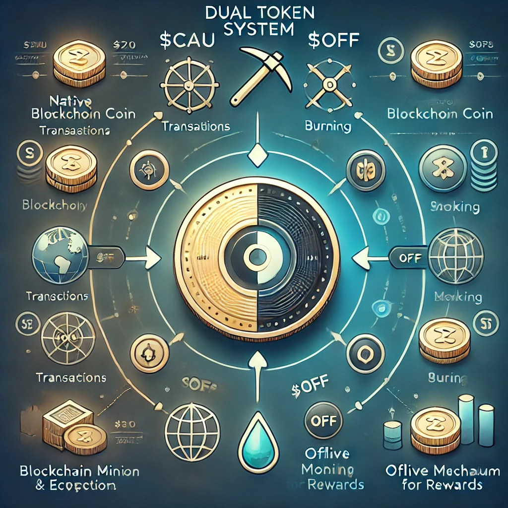

# Dual Token System

Canxium introduces a unique dual-token system designed to optimize the functionality, rewards, and user experience within its ecosystem. The two tokens, **$CAU** and **$OFF**, each serve distinct and critical roles that support both the network's operational structure and its long-term sustainability.

### 1. **Native Utility Coin: $CAU**

The **$CAU** token is Canxium’s native cryptocurrency, serving as the primary utility coin within the Canxium blockchain ecosystem. It is used for a wide range of functions, including:

- **Transaction Fees**: $CAU is required to pay transaction fees on the network, enabling users to perform various operations such as transferring funds or interacting with smart contracts.
  
- **Miner Registration**: Miners need to deposit **$CAU** in the Work Distribution Contract to register for PoW 2.0 mining and participate in block creation.

- **Platform Benefits**: Holding $CAU offers users access to special privileges, discounts, or incentives on the platform as the ecosystem evolves.

As the backbone of Canxium's ecosystem, $CAU will drive the network's services and functions, ensuring a stable and functional economic model for users, miners, and other stakeholders.

You can buy CAU from [Mexc](https://www.mexc.com/exchange/CAU_USDT) or [Coinex](https://www.coinex.com/en/exchange/CAU-USDT)

### 2. **Mining Token: $OFF**

Proof of Work is at the core of Canxium's design. After transitioning to **Retained PoW mining**, Canxium introduced **$OFF**, a secondary token specifically for mining activities. 

- **Mining Rewards**: Miners will use the $OFF token in conjunction with mining activities. They will need to burn **$OFF** tokens with each mining transaction to have more **$CAU** rewards. This burn mechanism ensures that the value of $OFF remains integral to the mining process and further supports Canxium's economic model by introducing scarcity and incentivizing participation.

- **Retained PoW Mining**: With the Retained PoW mining mechanism in place, miners will be able to mine new CAU coins without needing a constant internet connection, but they will still need to use $OFF to enhance their mining rewards by 5%.

This token's introduction provides a clear distinction between **network utility and mining rewards**, while also offering miners a direct method to optimize their participation and rewards in the ecosystem.

You can buy OFF from [Canxium Swap](https://app.canxium.org/)