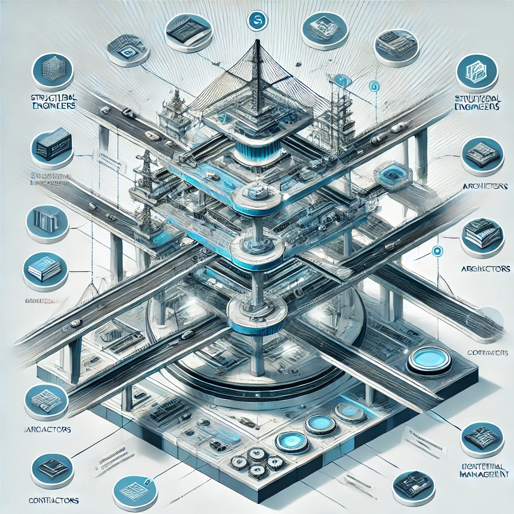

# Canxium Bridge: The Safest Crypto Bridge 🛟

The **Canxium Bridge**, available at [app.canxium.org/#/bridge](https://app.canxium.org/#/bridge), is designed to securely transfer assets between the Canxium and Ethereum networks. Building a secure bridge between blockchains is challenging, as numerous hacks have targeted other bridges, leading to billions of dollars in losses. Canxium introduces a multi-layered security solution that aims to be the safest bridge available today.

:::info
Bridge is still in the early stages of its development roadmap, operating in a centralized manner and managed by the Canxium Labs. In the future, it will transition to being fully decentralized under the governance of validators.
:::

### Key Security Features of Canxium Bridge

1. **Multi-Tiered Permission Structure** 
   
   The Canxium Bridge’s structure uses three different roles—**Operator**, **Guarder**, and **Admin**—to secure asset transfers:
   - **Operator**: A hot wallet that monitors and initiates transfer events between Canxium and Ethereum. It sends asset information transactions to the target chain. After confirmation of 10 blocks, users can claim the assets.
   - **Guarder**: A cold wallet that monitors the Operator. If it detects any suspicious or inappropriate actions, it can halt smart contract operations by sending a pre-signed transaction. This ensures that private keys remain secure, as the Guarder operates offline.
   - **Admin**: The highest authority, also managed via a cold wallet. Admin has the power to cancel any transactions flagged by the Guarder and can reactivate the contract after removing invalid data and replacing compromised operators.

2. **Cold Wallet Integration for Enhanced Security**  
   Guarder and Admin functions are operated with cold wallets, significantly reducing exposure to online environments and preventing private key leaks.

3. **Distributed Server Setup for Guarder Role**  
   Canxium has deployed multiple servers for the Guarder role, with all login permissions removed from all but essential nodes. This decentralized setup makes it nearly impossible to breach all Guarder nodes to prevent them from executing pause commands on the contract.

4. **Controlled Asset Access**  
   The bridge limits the Operator’s access to only 30% of total assets, with additional access requiring Admin permission. This mitigates potential damages in case of an Operator compromise.

Although this setup doubles asset transfer costs, it achieves a nearly absolute level of security for users, leveraging decentralized controls and offline components to prevent unauthorized transfers, minimize key exposure, and ensure a rapid response to any suspicious activity. 

You can try out the Canxium Bridge here: [app.canxium.org/#/bridge](https://app.canxium.org/#/bridge).

Bridge contract is audited by [TechRate](https://github.com/TechRate/Smart-Contract-Audits/blob/main/November_2023/CanxiumBridge.pdf)