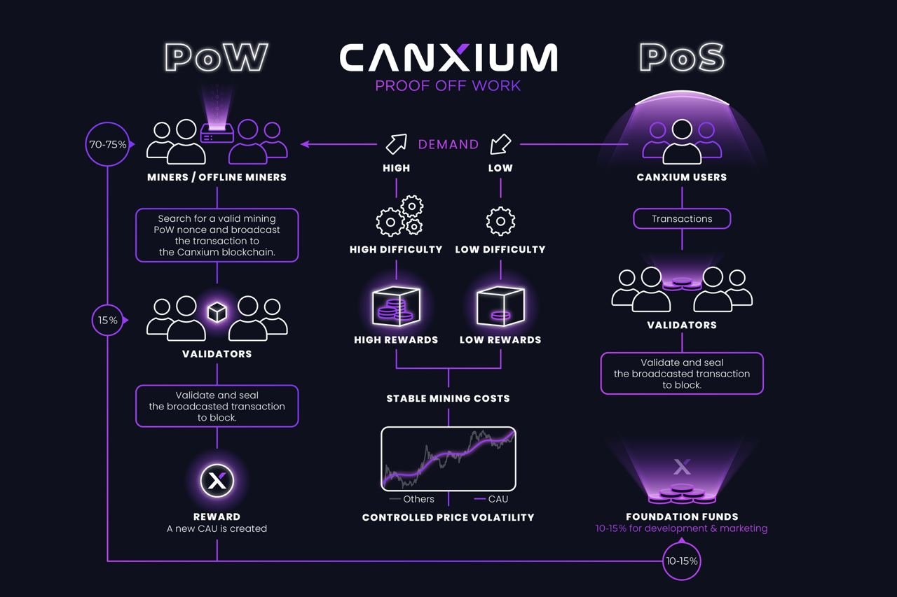

# Consensus

Canxium is an advanced layer-one blockchain platform designed to bring stability, reliability, and inclusivity to the cryptocurrency ecosystem. At its core, Canxium introduces a revolutionary demand-driven supply mechanism, dynamically adjusting coin supply in response to real-world demand. This approach helps stabilize currency value while fostering a resilient and adaptable economic model, offering both users and investors a reliable digital asset.

One of Canxium’s standout innovations is its Retained PoW Mining feature, which allows individuals in regions with limited internet access to participate in mining. This breakthrough not only broadens global access to cryptocurrency but also promotes financial inclusion by empowering underserved communities to engage with digital finance.

Canxium is designed to address persistent challenges that hinder widespread cryptocurrency adoption: price volatility, scalability, accessibility, and reliability. By tackling these issues, Canxium aims to create a stable, sustainable digital economy capable of supporting real-world applications and everyday transactions.

What truly sets Canxium apart is its multi-consensus model, which integrates three consensus algorithms - Proof of Work (PoW), Proof of Demand (PoD), and Proof of Stake (PoS) - within a single blockchain. Each algorithm brings unique strengths to the network: PoW provides high-level security, PoD ensures the network adapts to real-time demand, and PoS offers energy efficiency. This strategic blend allows Canxium to counterbalance the weaknesses of each method, resulting in a cohesive and robust blockchain.

By combining these consensus mechanisms, Canxium creates a stable, scalable, and decentralized ecosystem that can seamlessly adapt to network demands, accommodate diverse participation, and ensure fair reward distribution. This carefully engineered structure establishes Canxium as a forward-thinking blockchain platform, poised to lead the next generation of digital economies through an innovative, inclusive, and resilient approach.

The native coin, CAU, powers this ecosystem, facilitating transactions, staking, and network governance.

For more info about Canxium's consensus, read our whitepaper: [Whitepaper](/whitepaper/depth/summary)
