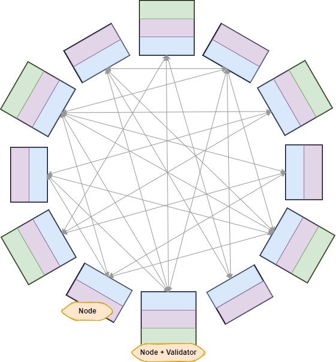
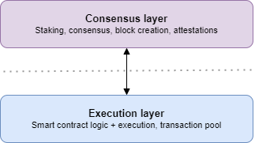

Canxium is a decentralized **network** of **nodes** that communicate via peer-to-peer connections. These connections are formed by computers running Canxium's specialized client software:

## Nodes

An Canxium **node** is a running instance of Canxium's client software. This software is responsible for running the Canxium blockchain. 

There are two primary types of nodes in Canxium: **execution nodes** and **beacon nodes**. Colloquially, a "node" refers to an execution node and beacon node working together. Nodes establish connections with other nodes running on other computers, forming a decentralized peer-to-peer network that processes Canxium blocks and transactions.

When users stake 320 CAU to participate in Canxium's proof-of-stake consensus mechanism, they use a separate piece of software called a **validator client**, which connects to their Prysm beacon node. This is special piece of software that manages validator keys and duties such as producing new blocks and voting on others' proposed blocks. Validator clients connect to the Canxium network through beacon nodes, which depend on execution nodes:

| Component    | Description |
| -------- | ------- |
| Canxium node, aka "Node"  | A Canxium node is an <strong>execution node</strong> and <strong>beacon node</strong> working together. Canxium nodes communicate peer-to-peer to secure the Canxium network, and require both <strong>execution-layer client software</strong> and <strong>consensus-layer client software</strong>.    |
| Execution node | Execution nodes use execution client software to process transactions and smart contracts in Canxium's <strong>execution layer</strong>. [Go Canxium](https://github.com/canxium/go-canxium) is an execution client software.   An execution node will talk to other execution nodes via peer-to-peer networking, and to a local beacon node.     |
| Beacon node    | Beacon nodes use beacon node client software to coordinate Canxium's proof-of-stake consensus. [Prysm](https://github.com/canxium/prysm), [Lighthouse](https://github.com/canxium/lighthouse), and [Lodestar](https://github.com/canxium/lodestar) are consensus clients that contain both beacon node and validator client software.    A beacon node will talk to other beacon nodes via peer-to-peer networking, to a local execution node, and (optionally) to a local validator.    |
| Validator    | Validator clients are specialized software that let people stake 320 CAU as collateral within Canxium's <strong>consensus layer</strong>. Validators are responsible for proposing blocks within Canxium's proof-of-stake consensus mechanism, and will fully replace proof-of-work miners after the fork.    A validator will talk only to a local beacon node. A validator's beacon node tells the validator what work to do, and broadcasts the validator's work to the Canxium network as the validator performs its duties.    |

## Networks

The Canxium network that hosts real-world applications is referred to as **Canxium Mainnet**. Canxium Mainnet is the live, **production** instance of Canxium that mints and manages real Canxium (CAU) and holds **real** monetary value.

There are other live, **test** instances of Canxium that mint and manage **test** Canxium. Each test network is compatible with (and only with) its own type of test CAU. These test networks let developers, node runners, and validators test new functionality before using real CAU on Mainnet.

Every Canxium network is divided into two layers: **execution layer** (EL) and **consensus layer** (CL):

Every Canxium node contains software for both layers: **execution-layer** client software (like Go-canxium), and **consensus-layer** client software (like Prysm, Lighthouse, and Lodestar).

Every network's execution layer works with (and only with) its corresponding "partner" consensus layer. EL-CL network pairs work together to run Canxium proof-of-stake.

## Frequently asked questions

**Can I run an execution node without running a beacon node?**  
No. Although this is possible before, but now, all Canxium network participants will need to run both an execution node and a beacon node.

**What happened to miners?**  
Block mining traditionally relies on a proof-of-work consensus mechanism. However, Canxium has now transitioned to a proof-of-stake consensus, replacing traditional miners with validators responsible for verifying and maintaining the blockchain. Canxium’s miners will now operate through its innovative Retained PoW Mining feature.

**Where do slashers come into play?**  
Slashers, like validators, use specialized pieces of consensus-layer client software to fulfill a critical responsibility for the Canxium network. Slashers attempt to detect and punish malicious validators. Learn more by reading our [Slasher documentation](https://docs.prylabs.network/docs/prysm-usage/slasher).

**How do I get testnet CAU?**  
We recommend using [Canxium's Faucet](https://faucet.canxium.org/).

