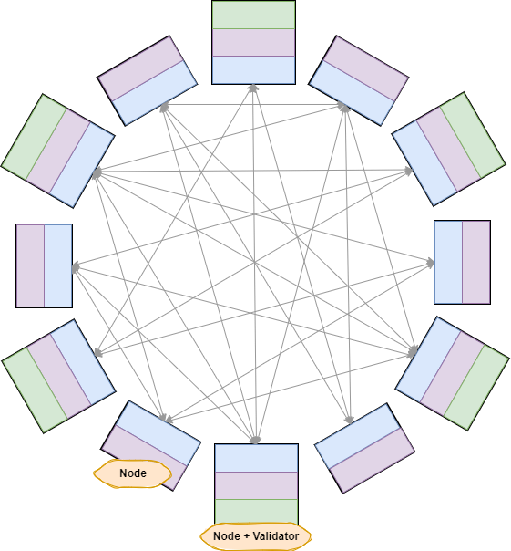

Canxium is a decentralized **network** of **nodes** that communicate via peer-to-peer connections. These connections are formed by computers running Canxium's client software:

## Nodes

A Canxium **node** is a running instance of Canxium's client software, [go-canxium](https://github.com/canxium/go-canxium). Since the switch to PoW 2.0, a node is a single binary - no separate consensus/beacon client is needed. Nodes establish connections with other nodes running on other computers, forming a decentralized peer-to-peer network that processes Canxium blocks and transactions.

| Component | Description |
| -------- | ------- |
| Node | A running instance of go-canxium. It processes transactions and smart contracts, verifies PoW 2.0 blocks, and serves JSON-RPC requests. Every network participant runs this same software. |
| Mining node | A node started with the mining flags (`--mine`, `--miner.etherbase`, `--miner.signerkey`). It searches the nonce range assigned to its registered miner by the Work Distribution Contract and seals blocks. See [Run a PoW 2.0 Node](/guide/pow2/node). |

## Networks

The Canxium network that hosts real-world applications is referred to as **Canxium Mainnet**. Canxium Mainnet is the live, **production** instance of Canxium that mints and manages real Canxium (CAU) and holds **real** monetary value.

There are other live, **test** instances of Canxium that mint and manage **test** Canxium. Each test network is compatible with (and only with) its own type of test CAU. These test networks let developers, node runners, and miners test new functionality before using real CAU on Mainnet.

## Frequently asked questions

**Do I still need a beacon node or validator client?**  
No. Beacon and validator clients belonged to the retired hybrid Proof of Stake era. Under PoW 2.0 the go-canxium binary is the entire node. If you still run a validator, see the [PoW 2.0 overview](/guide/pow2/overview#what-this-means-for-you).

**What happened to miners?**  
Miners are back at the heart of consensus. Under PoW 2.0, miners register in the Work Distribution Contract, receive an exclusive nonce range, and cooperatively seal blocks. See [Register a Miner](/guide/pow2/register).

**How do I get testnet CAU?**  
We recommend using [Canxium's Faucet](https://faucet.canxium.org/).
