<script setup>
import { VTCodeGroup, VTCodeGroupTab } from '@vue/theme'
</script>

# Quick Start {#quick-start}

## Install Canxium Node

1. **Start the Node**:
  - Run the following to start your node and begin syncing with the network:
    ```bash
    
    bash <(curl -fsSL https://raw.githubusercontent.com/canxium/scripts/refs/heads/main/beacon.sh)
    ```
  - Syncing may take some time. Confirm connection and sync status of the node:
    ```bash
    journalctl -f -u node
    ```
  - Confirm connection and sync status of the beacon PoS node:
     ```bash
     journalctl -f -u beacon
     ```

## Set Up a Wallet

1. **Download & Setup Wallet**:
  - If you're using Android, Install the official Canxium Wallet from [Google Play](https://play.google.com/store/apps/details?id=com.canxium.mobile)

    | a. Click *Create a Wallet* 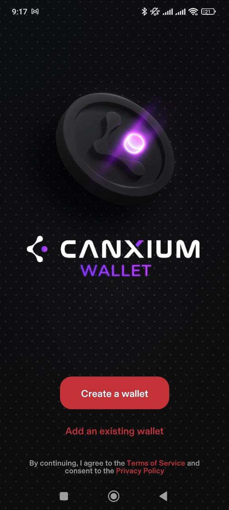    | b. Click *Let's keep it safe* 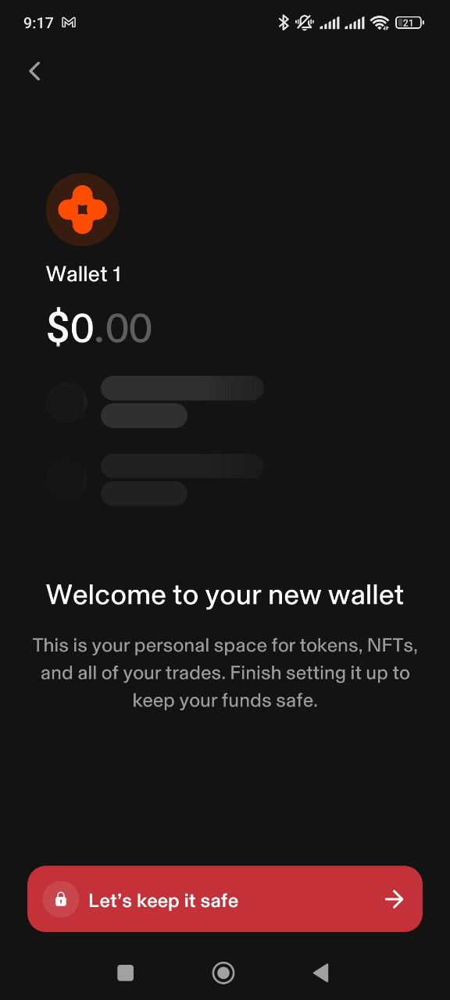 |
    | -------- | ------- |

    | c. Click *Manual backup* 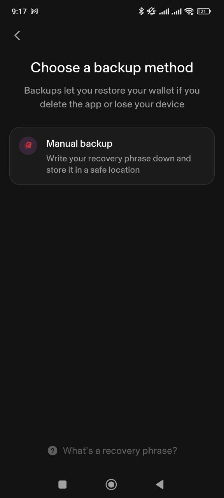    | d. Click *Continue* 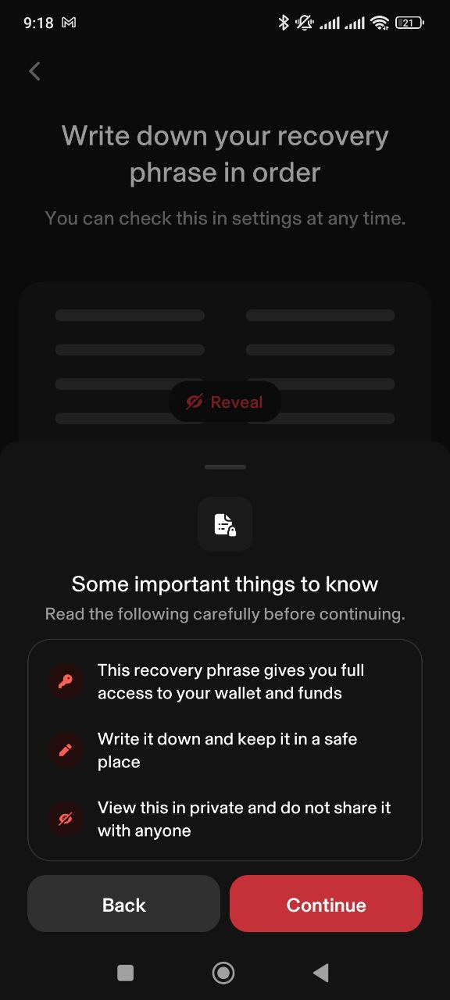 |
    | -------- | ------- |


    | e. Click *Continue* 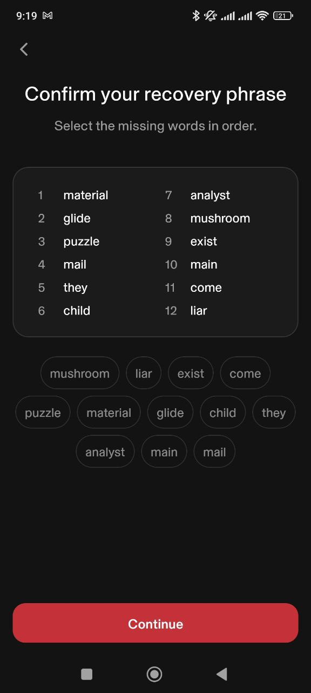    | f. Click *Continue* 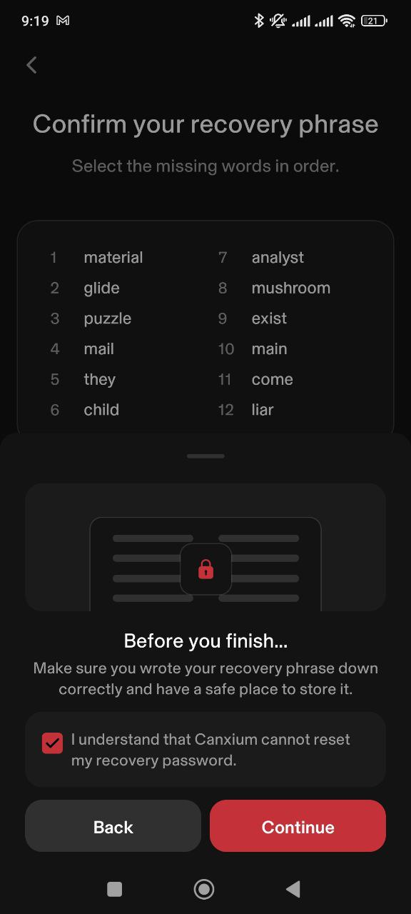 |
    | -------- | ------- |
    | h. Done 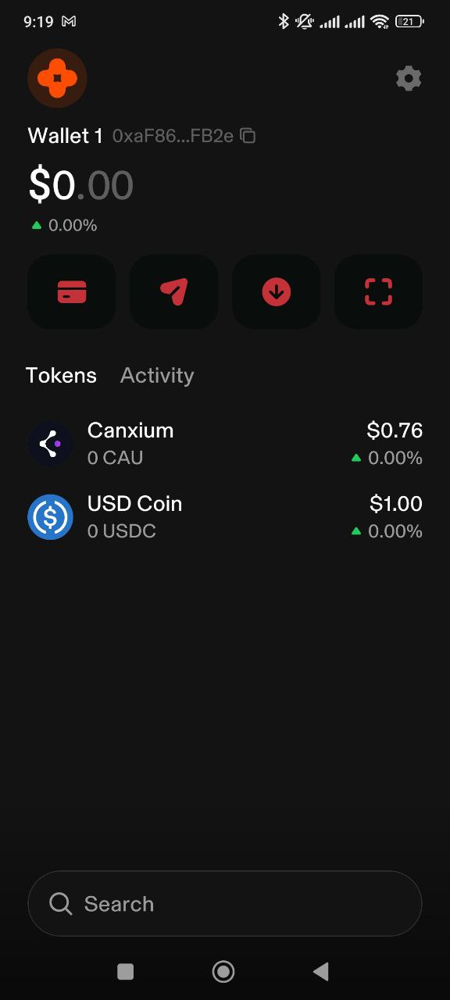 | |

    
  - If you're using iOS, Install a 3rd wallet: [Metamask](https://metamask.io/download/)

    | a. Click *Setting Icon* 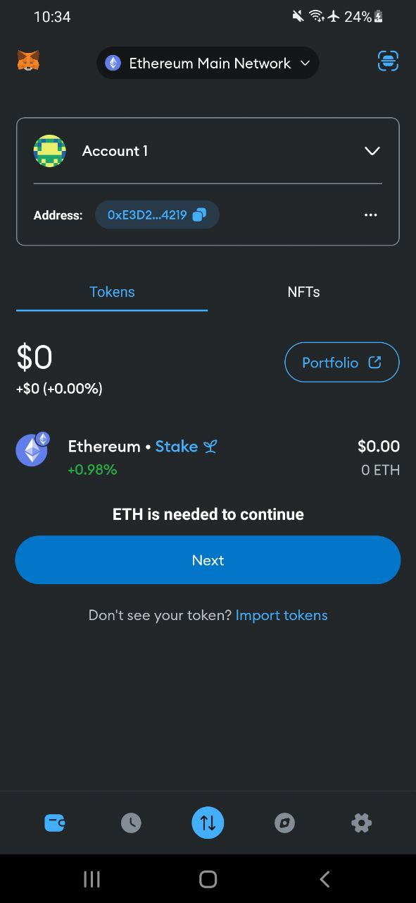    | b. Click *Networks* 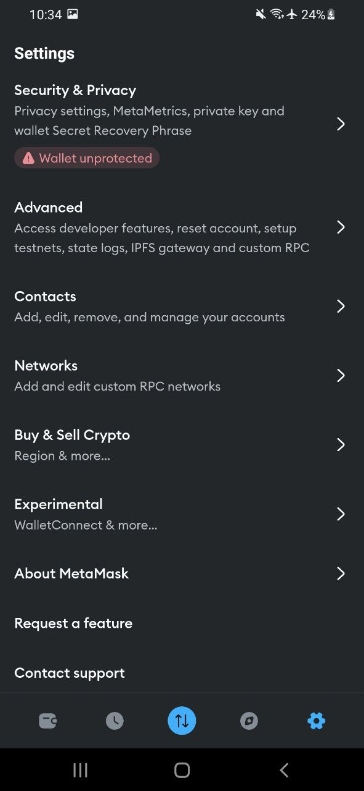 |
    | -------- | ------- |

    | c. Click *Add Network* 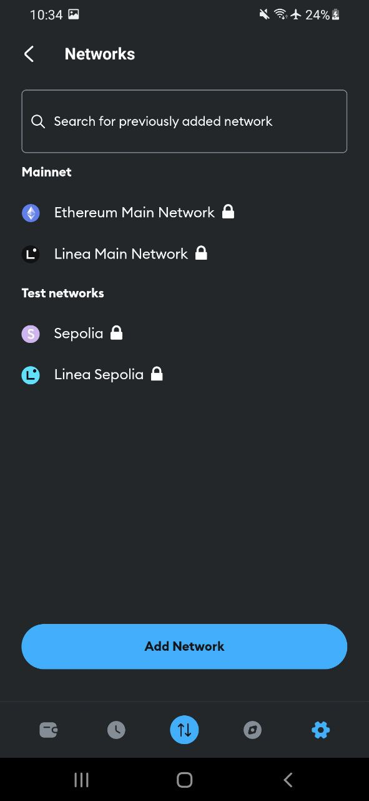    | d. Add Canxium 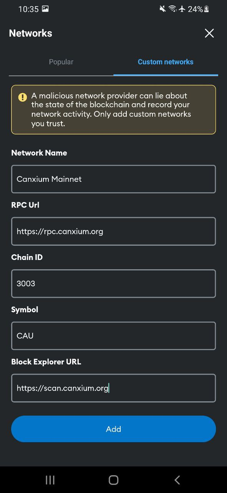 |
    | -------- | ------- |


    | e. Click *Confirm* 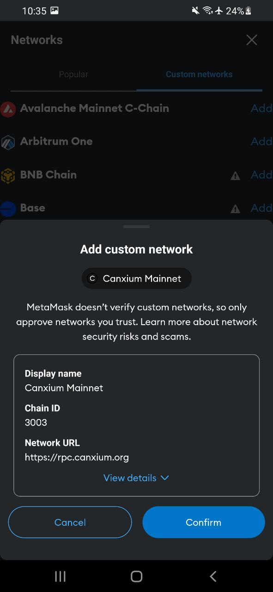    | f. Click *Switch to network* 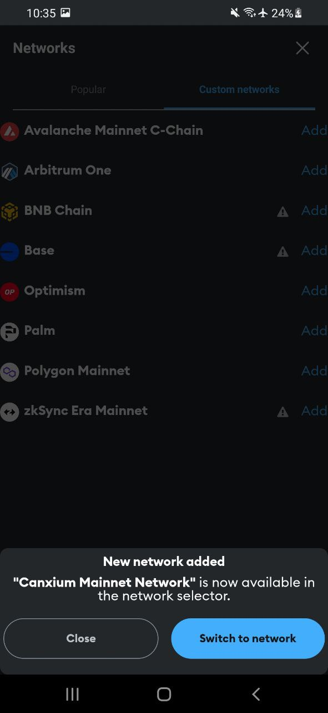 |
    | -------- | ------- |
    | h. Done 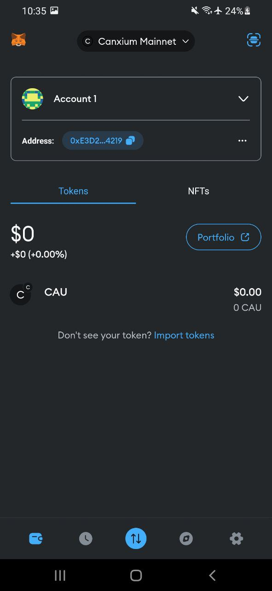 | |

2. **Buy Some CAU**:
   - Buy some CAU from [Mexc](https://www.mexc.com/exchange/CAU_USDT) or [Xeggex](https://xeggex.com/market/CAU_USDT) or [Bitget](https://www.bitget.com/spot/CAUUSDT)

3. **Try the Dex**:
   - Open your wallet and copy the Address.
   - Withdraw your CAU from the Cex, and try our [Dex](https://app.canxium.org/).

## Deploy a Basic Smart Contract

1. **Set Up Your Development Environment**:
   - Use Remix (online IDE) for a quick start or Visual Studio Code with Solidity plugins if you prefer local development.

2. **Write and Compile Contract**:
   - Start with a simple Solidity contract, like an ERC-20 token, and compile it in your IDE.

3. **Get Testnet CAU**:
   - Get 1000 Testnet CAU from [Faucet](https://faucet.canxium.org/)

4. **Deploy to Testnet**:
   - Deploy the contract on Canxium’s testnet first. Use a compatible wallet or your node to deploy.
   - RPC Info:
   ```
   Chain Id: 30203
   RPC: https://pr-rpc.canxium.net
   ```

5. **Verify on Explorer**:
   - Check the transaction and contract details on the [Canxium Testnet Explorer](https://testnet-scan.canxium.net/) to ensure it deployed correctly.


4. **Deploy to Mainnet**:
   - Make sure your wallet have at least 102 CAU.
   - RPC Info:
   ```
   Chain Id: 3003
   RPC: https://rpc.canxium.org
   ```

5. **Verify on Explorer**:
   - Check the transaction and contract details on the [Canxium Explorer](https://scan.canxium.org/) to ensure it deployed correctly.
---

### You’re Ready!

This quick setup should help you start exploring and deploying on Canxium. For more details, dive into the official docs and community resources. Happy building!
