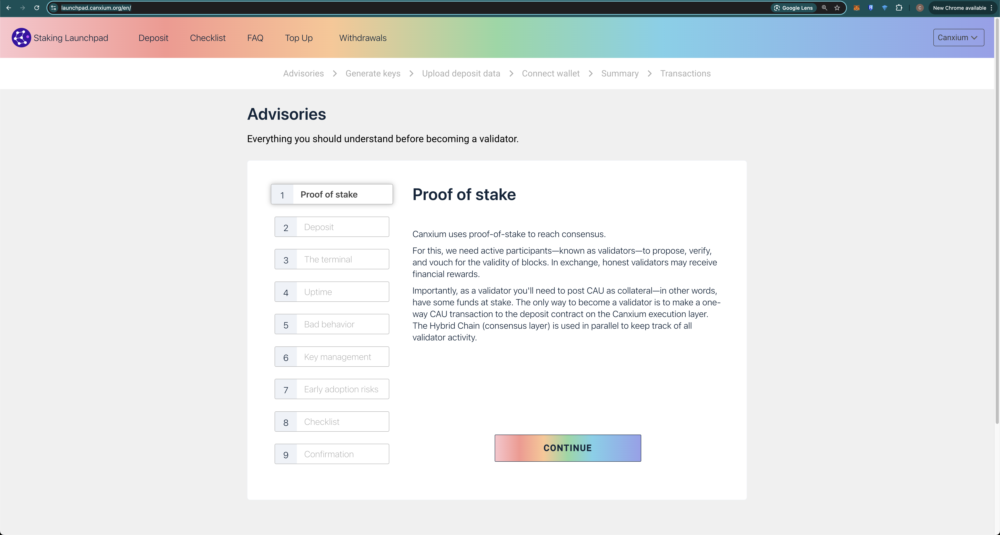
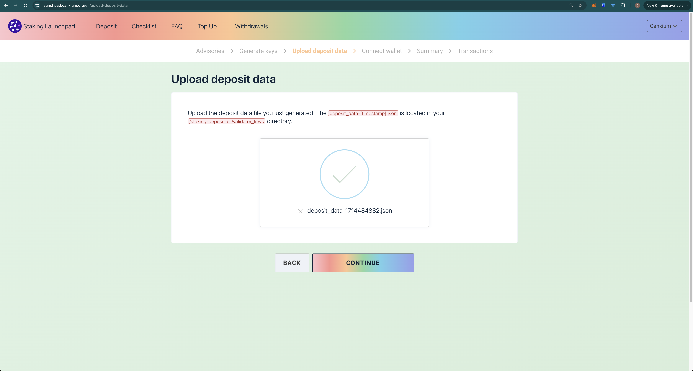

# Deposit CAU

After successfully creating a key for the validator, you need to use the deposit_data*.json file to deposit CAU into the network.

Go to [Canxium Validator Launch](https://launchpad.canxium.org/en/) and start depositing your 320 CAU

After signing and submitting the deposit transaction, you will need to wait approximately 8 hours to see your validator on the [Validator List](https://epoch.canxium.org/validators)
