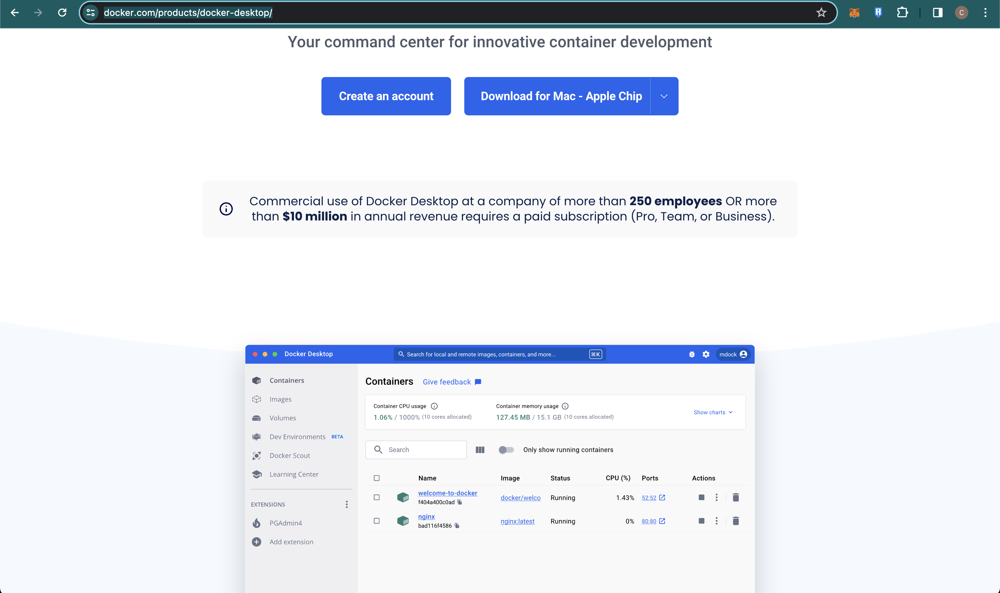
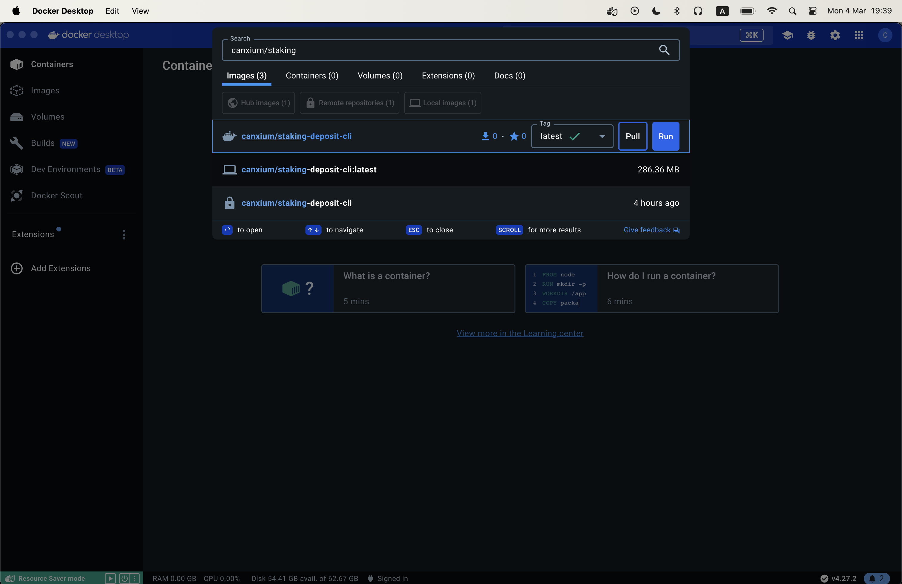
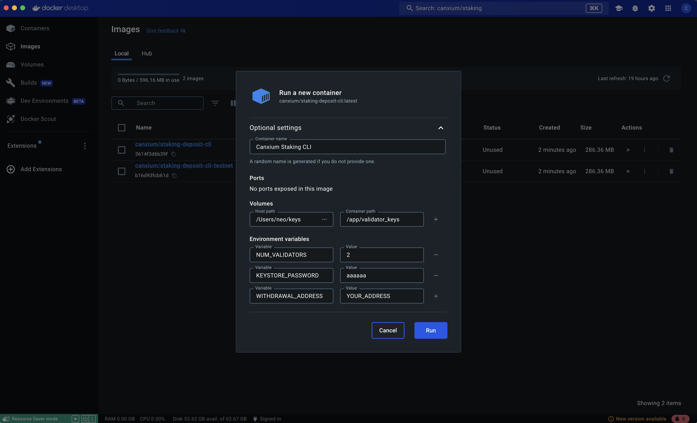

# Create Validator keys

Each validator needs a private key to operate, and these private keys must be kept secure.

## Using Script
To create new keys, please run this docker script:

```
docker run -e NUM_VALIDATORS=1 -e KEYSTORE_PASSWORD=123456789 -e WITHDRAWAL_ADDRESS=0xBd65D6efb2C3e6B4dD33C664643BEB8e5E133055 -v ./keystores:/app/validator_keys canxium/staking-deposit-cli:v0.1
```

Please replace the *KEYSTORE_PASSWORD* and *WITHDRAWAL_ADDRESS* with your own password and address. If you lose your password or lose access to the withdrawal wallet, you will lose all the CAU you have deposited.

After the script runs successfully, you will receive two files in the *./keystores* folder:

```deposit_data-1712896419.json``` and ```keystore-m_12381_3600_0_0_0-1712896418.json```

## Using Docker Gui

If you are not familiar with running scripts, you can use Docker GUI.

Step 1: Download and install the docker app for your operating system


Step 2: Pull docker image: canxium/staking-deposit-cli



Step 3: Start the docker cli, Fill in all information as below

For security, we recommend you disconnect from the internet to complete this step.



Step 4: Write down the mnemonic in a safe place, Write it down on paper and keep it carefully


Step 5: Your deposit-data*.json and keystore-*.json can be found at the host path
