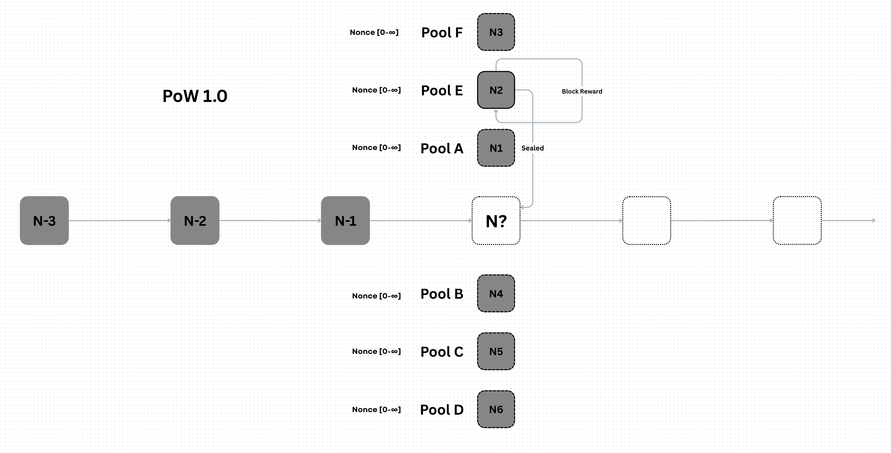
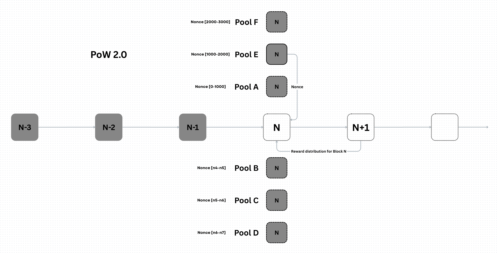

# PoW 2.0: Cooperative Consensus Protocol (CCP) Whitepaper
**Status:** Proposal
**Category:** Consensus Algorithm / Layer 1

This redesigned protocol represents Canxium's return to its core Proof-of-Work heritage. A year ago, Canxium transitioned to a complex hybrid model to support cross-chain and offline mining, but that architecture proved to be an unsuitable long-term fit. PoW 2.0 (CCP) is the result of a complete re-engineering of the PoW mechanism, preserving its security while dramatically boosting efficiency and scalability to deliver a next-generation, pure PoW network.

PoW 2.0 fundamentally shifts the mining paradigm from Competitive Redundancy (PoW 1.0) to Cooperative Efficiency. It uses a system-level Work Distribution Contract (WDC) to coordinate global mining efforts, preserving the decentralized security of Proof-of-Work while eliminating its core inefficiencies.

## 1. Abstract

This document proposes PoW 2.0, a Cooperative Consensus Protocol (CCP) designed to eliminate the structural inefficiencies of legacy Proof-of-Work systems.

Traditional PoW relies on open competition, where miners independently construct block templates and race to discover a valid nonce. While simple, this model inherently produces:

- Orphaned and stale blocks.

- Redundant transaction execution.

- And significant wastage of global hash power.

PoW 2.0 replaces adversarial block construction with network-wide cooperation over a single global state. A system-level smart contract governs Work Distribution, deterministically assigning nonce ranges to registered mining pools. All miners therefore contribute hash power toward sealing the same block, rather than competing to create different ones.

To further optimize throughput and latency, PoW 2.0 introduces a Pipelined Consensus Model. In this model, the producer of Block `N` is granted the authority to define the transaction set for Block `N+2`. This deliberate temporal separation creates a deterministic execution pipeline in which:

- Transaction selection is finalized in advance.

- State execution occurs ahead of block sealing.

- And mining is reduced to pure cryptographic work over a known state root.

This architecture ensures that approximately 100% of the network’s hash power secures a single canonical chain at all times, as miners no longer compete over block contents or templates, but solely over the discovery of a valid nonce for an already-agreed state.

Honest behavior is enforced through a Lagged Reward Mechanism, implemented entirely via on-chain logic, in which the reward for Block `N` is deterministically settled in Block `N+1` based on the published nonce. This design economically penalizes nonce withholding, invalid transaction selection, or protocol deviation, while eliminating incentives for forking or private coordination - achieving enforcement without reliance on social consensus or off-chain governance.

PoW 2.0 thus redefines Proof-of-Work not as a competitive lottery, but as a coordinated, deterministic, and continuously flowing consensus system, capable of achieving higher security, lower latency, and dramatically improved resource efficiency.

## 2. Problem Statement: The Limits of Legacy PoW (PoW 1.0)

Legacy Proof-of-Work systems (PoW 1.0) are constrained by a fundamental `Stop-and-Go` execution model. At each block height, miners independently construct block templates and race to discover a valid nonce. When one (or more) blocks are found, the entire network must halt forward progress, download the winning block(s), verify the proof of work, and re-execute all transactions to compute the new global state before mining can safely resume.

This tightly coupled process introduces Execution Latency as a first-order bottleneck. Because transaction execution and block discovery occur at the same height, state finality cannot be assumed until full validation completes across the network. To avoid persistent chain splits, PoW 1.0 networks are therefore forced to artificially lengthen block intervals (e.g., Bitcoin’s ~10 minutes), trading throughput and latency for stability.

Simultaneous block discovery further exacerbates the problem. When multiple valid blocks are found at the same height, the network temporarily forks, and all but one branch are eventually discarded as orphan blocks. Although these blocks represent real and valid energy expenditure, their work does not contribute to long-term chain security, reducing the effective utilization of global hash power and weakening the system’s thermodynamic efficiency.

As block times decrease, these issues compound non-linearly:

- Fork rates rise sharply.

- Nodes are forced to repeatedly roll back and re-execute transactions.

- And a growing fraction of hash power is wasted on blocks that never become canonical.

As a result, PoW 1.0 systems struggle to support high-speed block execution. Increased energy consumption does not translate proportionally into security or throughput, while frequent soft forks and redundant execution reduce practical TPS and increase time-to-surface (the delay between transaction submission and irreversible inclusion).

These limitations are not implementation flaws, but structural properties of competitive, single-height PoW consensus - placing a hard ceiling on scalability, latency reduction, and energy efficiency.

## 3. Protocol Architecture: PoW 2.0

### 3.1. The Work Distribution Contract (WDC)
The WDC is a system Smart Contract that acts as the network's consensus coordinator.

* **Deposit Requirement:** Pools must stake (deposit) CAU tokens to participate.
* **Nonce Partitioning:** The contract divides the total Nonce Space ($\mathcal{N}$) into non-overlapping subsets based on the pool's registered capacity.

**Mathematical Definition:**

Let $\mathcal{N}$ be the total Nonce Space. Let $P = \{P_1, P_2, \ldots, P_k\}$ be the set of registered pools.

The WDC assigns a subset $R_i \subset \mathcal{N}$ to each pool $P_i$ such that:

$$
\bigcup_{i=1}^{k} R_i \subseteq \mathcal{N}
\quad \text{and} \quad
R_i \cap R_j = \emptyset \;\; \forall\, i \neq j
$$

### 3.2. The "$N+2$" Transaction Rule

Under PoW 2.0, the miner (or pool) that discovers the valid nonce for Block $N$ is granted the authority to define the transaction list (TxList) for Block $N+2$.

This two-block lookahead ensures that:

- While the network is mining Block $N$, the contents of Block $N+1$ are already known and fixed.

- Transaction execution and state transitions for upcoming blocks can proceed deterministically and in advance.

- Mining is reduced to sealing an already-executed state root, eliminating execution latency from the critical path.

As a result, transaction ordering, execution, and block production operate as overlapping stages in a continuous pipeline.

Let:

* $\mathcal{T}_i$ be the transaction list of block $B_i$
* $\mathcal{E}(\mathcal{T}_i, S_{i-1}) \rightarrow S_i$ be the deterministic execution function

The transaction list for block $N+2$ is fixed at height $N$:

$$
\mathcal{T}_{N+2} \leftarrow \text{SelectTx}(B_N)
$$

This enforces the invariant:

$$
\mathcal{T}_{N+1} \text{ is known and immutable while mining } B_N
$$

During mining of $B_N$, the network can already execute:

$$
S_{N+1} = \mathcal{E}(\mathcal{T}_{N+1}, S_N)
$$

Mining therefore operates over a **pre-executed state root**, removing execution from the critical path.

### 3.3. Lagged Reward Settlement and Fast Nonce Propagation

To preserve cooperation and prevent strategic withholding, PoW 2.0 separates **block sealing** from **reward distribution**.

The miner that discovers the valid nonce for **Block $N$** does **not** receive its reward in Block $N$. Instead, reward settlement occurs in **Block N+1** via a mandatory system transaction.

Upon discovering a valid nonce:

1. The miner immediately broadcasts the nonce to the network.
2. Nodes verify the nonce against the agreed Block $N$ header.
3. Block $N$ is sealed without modification, regardless of which pool found the nonce.

In **Block $N+1$**, a system-level smart contract:

* Queries the finalized header of Block $N$,
* Maps the winning nonce to its assigned nonce range and registered pool address,
* And deterministically distributes the reward.

Because Block $N$’s contents are immutable and rewards are delayed:

* Nonce withholding provides no advantage,
* Fast propagation is strictly incentivized,
* And block authorship is fully decoupled from transaction inclusion.

#### Lagged Reward Function
Let $n_N$ be the winning nonce for block $B_N$.

The reward for block $N$ is settled in block $N+1$ via a system transaction:

$$
\text{Reward}(B_N) = f(n_N)
$$

where:

$$
f(n_N) =
\begin{cases}
\text{reward}(P_j), & \text{if } n_N \in R_j \\\\
0, & \text{otherwise}
\end{cases}
$$

Thus, the reward is applied as a state transition:

$$
\text{Reward}(B_N) \subseteq \Delta S_{N+1}
$$

Block $B_N$ is invariant with respect to miner identity:

$$
B_N^{(P_a)} = B_N^{(P_b)} \quad \forall P_a, P_b
$$

Only the state of $B_{N+1}$ differs.

#### Fast Nonce Propagation Incentive

Let $t_b(n)$ denote the broadcast time of nonce $n$.

For two competing nonces $n_a$ and $n_b$:

$$
t_b(n_a) < t_b(n_b) \Rightarrow n_a \text{ is canonical}
$$

Because reward settlement is delayed:

$$
\frac{\partial \text{Reward}}{\partial \text{Delay}} < 0
$$

Thus, the miner's optimal strategy is:

$$
\operatorname*{arg\,max}_{P_j} \text{Reward}(P_j) = \min_{n_j} t_b(n_j)
$$

Nonce withholding is strictly dominated.

### 3.4. Continuous Sealing and Pipeline Liveness

Once the nonce for Block $N$ is broadcast and verified:

- Block $N+1$ can be sealed immediately.

- The reward settlement executes as the final state transition.

- And mining on Block $N+1$ begins without interruption.

This guarantees continuous liveness of the pipeline, minimizes inter-block latency, and ensures that nearly 100% of network hash power continuously secures a single canonical chain.

So:

Once nonce $n_N$ is broadcast and verified:

$$
\text{Seal}(B_{N+1}) \rightarrow \text{valid}
$$

Mining proceeds immediately:

$$
B_{N+1} \rightarrow B_{N+2}
$$

Establishing the pipeline invariant:

$$
\forall N:
\begin{cases}
\mathcal{T}_{N+2} \text{ is fixed} \\\\
S_{N+1} \text{ is pre-executed} \\\\
B_N \text{ is being mined}
\end{cases}
$$

### 3.5. Hash Power Utilization Theorem

Let $H_{\text{total}}$ be total network hash power and $H_{\text{effective}}$ the hash power securing the canonical chain.

In PoW 1.0:

$$
\mathbb{E}\left[\frac{H_{\text{effective}}}{H_{\text{total}}}\right] < 1
$$

In PoW 2.0 (CCP):

$$
\frac{H_{\text{effective}}}{H_{\text{total}}} \rightarrow 1
$$

as:

$$
\text{ForkRate} \rightarrow 0
$$

## 4. The Consensus Lifecycle

### Phase A - Steady State Pipeline (Before Nonce Discovery)

At height $N$, **all pools are already operating in a pipeline**.

#### Global Invariants

* $TxList_{N+1}$ is **fixed and known**
* $StateRoot_{N+1}$ is **pre-executed**
* $TxList_{N+2}$ is **not yet fixed**
* Mining is active on **Block $N$**

#### Pool $P_i$ (including Pool A)

1. Mine on **Block $N$** using the unified header:
   $$
   Hash(Header_N \parallel n) \le Target_{difficulty}, \quad n \in R_i
   $$
2. Execute (or finalize execution of) $TxList_{N+1}$
3. Prepare a candidate $TxList_{N+2}$ (local, tentative)

No sealing happens yet.
No rewards are assigned yet.

### Phase B - Nonce Discovery (Leader Election)

Assume **Pool A** discovers a valid nonce $n_A$ for Block $N$.

#### Pool A

1. **Immediately broadcast**:
   $$
   Payload_N = ({ Header_N, n_A, TxList_{N+2} })
   $$
2. Pool A does **not** modify Block $N$
3. Pool A does **not** receive reward yet

> At this moment:
>
> * Block $N$ becomes *sealable*
> * Pool A becomes *leader for transaction selection at $N+2$*

### Phase C - Verification & Block Finalization

Upon receiving $Payload_N$, all other pools:

1. Verify:
   $$
   Hash(Header_N \parallel n_A) \le Target_{difficulty}
   $$
2. Verify:
   $$
   n_A \in R_A
   $$
3. **Immediately halt mining on Block $N$**
4. Accept:
   $$
   TxList_{N+2} \leftarrow TxList_{N+2}^{(A)}
   $$

At this point:

* **Block $N$ is finalized**
* **Block $N$ is identical for all nodes**
* No state changes occur yet

---

### Phase D - Sealing Block $N+1$ and Reward Settlement

Now all nodes deterministically construct **Block $N+1$**.

#### Block $N+1$ Contents

* **Commits the pre-executed state transition** resulting from $TxList_{N+1}$
* Includes:

  * `StateRoot_{N+1}`
  * `TxRoot_{N+1}`
* Appends the mandatory **system reward transaction**:

$$
Reward(B_N) = f(n_N)
$$

Where:

$$
f(n_A) =
\begin{cases}
\text{Reward}(P_A), & n_A \in R_A \\\\
0, & \text{otherwise}
\end{cases}
$$

No more user-level execution occurs at height $N+1$.

#### Effects

* Reward for mining Block $N$ is paid in **Block $N+1$**
* No fork is possible
* No miner controls reward inclusion

### Phase E - Immediate Mining Transition

After sealing Block $N+1$:

1. All pools derive the mining header for **Block $N+1$**
2. Mining **immediately begins** on Block $N+1$
3. All pools:

   * Execute $TxList_{N+2}$
   * Compute $StateRoot_{N+2}$
   * Prepare candidate $TxList_{N+3}$

Pipeline invariant is restored.

## 5. Fork Resolution Mechanism (Nonce Conflict Handling) in PoW 2.0 (CCP)
### 5.1. Nature of Forks in PoW 2.0

Although the Cooperative Consensus Protocol (CCP) and nonce-space partitioning  
($S_i \cap S_j = \emptyset$) eliminate **nonce collision risks** caused by competition within the same search space, PoW 2.0 still acknowledges the possibility of forks due to **network latency**, when:

- **Two Independent Pools Win Simultaneously:**  
  Pool A finds nonce $N_A \in S_A$ and Pool B finds nonce $N_B \in S_B$ for the same **Unified Block Template** ($Header_N$) at nearly the same time, and the results propagate to different parts of the network.

- **Result:**  
  Some nodes receive $N_A$ first and build chain $C_A$.  
  Other nodes receive $N_B$ first and build chain $C_B$.  
  (The $N_A$ vs $N_B$ situation)

### 5.2. Fork Depth Stratification

In PoW 2.0, the vast majority of forks are **shallow forks** (1-block deep), concentrated at the currently mined block ($N$).

| Fork Depth | Frequency | Initial Impact | Mandatory Event Sequence | Performance Impact |
|-----------|----------|----------------|--------------------------|--------------------|
| **Block N** | Most frequent | Winning pool for block $N$ changes. | User transactions remain **unchanged** for $N+1$. Only the System Tx (reward) for $N+1$ is modified. | Minimal impact. No user transaction re-execution required for $N+1$. |
| **Block N−1** | Very rare | State of N and all user transaction of N+1 | **1. Block hash of $N−1$ changes.** **2. Parent hash of $N$ changes.** **3. Reward System Tx of $N$ changes.** **4. State root of $N$ changes.** **5. Parent hash of $N+1$ changes.** **6. Re-execution of $N+1$ (currently being mined).** | **Requires re-execution** of all user transactions on block $N+1$. |

> **Pipelining Advantage (N+2):**  
> A fork at block $N$ does **not** require re-executing user transactions for $N+1$ (current block), because those transactions have already been processed in advance.  
> The only change concerns the reward recipient address of the winning pool in the System Tx.

### 5.3. Chain Selection Rule (PoW 1.0 - Compatible)

Nodes follow the classic PoW rule:

- **Select the chain with the higher cumulative difficulty.**
- Because PoW 2.0 block time is extremely short (typically **1-1.5 seconds**) and network latency continues to decrease, the probability of a fork persisting beyond one block is **extremely low**.  
  Nodes will quickly observe the next block ($N+1$) built on one of the branches and converge on the longer chain.

## 6. Protection Against 51% Attacks

The fork resolution mechanism in PoW 2.0, combined with its architectural advantages, makes 51% attacks significantly more difficult and costly than in PoW 1.0.

### 6.1. Absolute Hashrate Requirement

- **PoW 1.0:**  
  An attacker can exploit reduced **effective hashrate** caused by orphan blocks, often succeeding statistically with less than 50% of effective hashrate.
- **PoW 2.0:**  
  Hashrate is **unified at ≈100%** on the canonical chain.  
  An attacker must control **more than 50% of the absolute total network hashrate**.

### 6.2. Operational Cost

- **PoW 2.0 (with LRM):**  
  An attacker must fully self-fund **all mining costs** on a private chain without receiving any block rewards until the chain is revealed and accepted.  
  This rapidly drives attack costs into an economically irrational range over short time horizons.

PoW 2.0 does not eliminate the *possibility* of network-induced forks, but it:

- **Renders forks harmless** (minimal impact on committed transactions), and
- **Economically discourages forks** (reward loss via LRM),

thereby significantly improving chain stability and security.

## PoW 2.0: Cooperative Consensus Protocol (CCP) Summary

PoW 2.0 fundamentally shifts the mining paradigm from **Competitive Redundancy** (PoW 1.0) to **Cooperative Efficiency**. It uses a system-level **Work Distribution Contract (WDC)** to coordinate global mining efforts, preserving the decentralized security of Proof-of-Work while eliminating its core inefficiencies.

### 1. Enhanced Security and Attack Deterrence

PoW 2.0 significantly raises the barrier and cost for a 51% attack through two key mechanisms:

* **Maximizing Security Budget:** By enforcing an identical block template and partitioning the nonce space, the system virtually eliminates orphan blocks. This ensures **$\approx 100\%$ of the network's total hashrate** is focused on the canonical chain, eliminating the "security dilution" found in PoW 1.0. An attacker must acquire **$> 50\%$ of the absolute total network hashrate**, not just the effective hashrate.
* **Economic Deterrence (Lagged Reward Mechanism - LRM):** The reward for Block $N$ is only paid out in Block $N+1$. This means an attacker mining a secret chain **receives no immediate revenue**, forcing them to bear the full cost of the attack out-of-pocket until the chain is revealed. This makes attacks economically unsustainable.

### 2. High Throughput and Zero-Latency Mining

The **Pipelined Consensus** model (N+2 Rule) decouples mining from transaction execution, solving the "Verification Gap" latency inherent in PoW 1.0.

* **Zero-Latency Transition:** Pools execute Block $N+1$'s transactions **while** mining Block $N$. When Block $N$ is found, the state for $N+1$ is ready, allowing for an **instantaneous switch** to mining $N+1$.
* **Increased TPS:** The elimination of the structural risk of forks allows the protocol to safely target a **significantly reduced Block Time** (e.g., 1-1.5 seconds), drastically increasing the overall Transactions Per Second (TPS) capacity.
* **Fork Reduction:** Nonce Partitioning removes the root cause of racing and simultaneous discovery on the *same* search space, reducing natural chain forks to only those caused by network propagation latency.

### 3. Stability and Fairness

* **Reduced Re-execution:** In the common case where a fork occurs at Block $N$, only the system reward transaction for Block $N+1$ changes. The vast majority of user transactions (which were committed two blocks earlier) **do not need to be re-executed**, minimizing disruption.
* **MEV Mitigation:** The transaction order for Block $N+2$ is committed and broadcast by the winner of Block $N$, making the transaction sequence deterministic and preventing malicious front-running by miners during the block production phase.
* **Energy Efficiency:** Every unit of electrical power consumed contributes to the final, accepted chain, achieving the highest possible efficiency ratio for a Proof-of-Work system.

## PoW 2.0 vs. PoW 1.0: Comparative Analysis

| Feature | PoW 1.0 (Legacy) | PoW 2.0 (CCP) | Improvement |
| :--- | :--- | :--- | :--- |
| **Hashrate Efficiency** | $< 100\%$ (Due to Orphan Blocks) | **$\approx 100\%$** (No forks/stales) | Maximized security budget. |
| **51% Attack Threshold** | $> 50\%$ of **Effective Hashrate** | **$> 50\%$ of Total Hashrate** | Higher security baseline. |
| **Attack Funding** | Self-subsidizing (Reward paid immediately). | **Zero subsidization** (LRM denies secret chain reward). | Strongest economic deterrent. |
| **Block Time (Typical)** | Long (e.g., 10 minutes) to prevent forks. | **Very Short (e.g., 1-1.5 seconds)** | Massive TPS boost. |
| **Mining Latency** | Stop-and-Go (Pause for execution). | **Zero-Latency** (Pipelined pre-execution). | Continuous mining flow. |
| **Transaction Ordering** | Dynamic/Chaotic (High MEV risk). | **2-Block Lookahead Commit** (Low MEV risk). | High predictability. |
| **Fork Causation** | Race condition over the entire Nonce space. | **Network latency** on partitioned Nonce space. | Structural reduction of forks. |