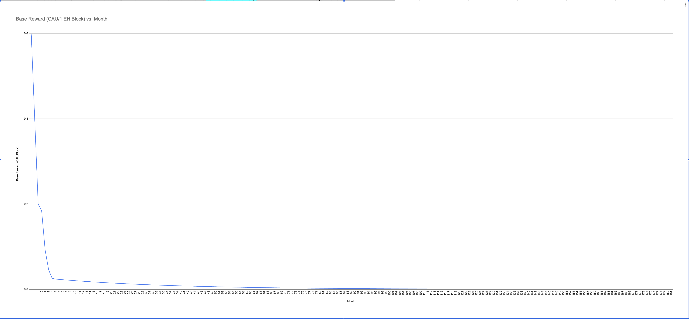

# Whitepaper {#whitepaper}

:::info You are reading the latest version of Canxium Whitepaper

- Updated on **Jan 26, 2025**.
- Version: v2.5.2
  :::


## Kaspa Merge Mining Rewards Proposal

### Merge Mining Rewards with Kaspa Chain

#### Overview
Merge mining rewards with the Kaspa chain are calculated using a dynamic reward mechanism designed to incentivize early miners while gradually reducing the rewards over time. The rewards are based on the mining difficulty and the number of days elapsed since the beginning of the merge-mining process.

The system is divided into four distinct reward phases, each with different base rewards and decay factors. This structure encourages early adoption while maintaining a sustainable reward model for long-term miners.

---

#### Reward Calculation Formula
The reward is calculated using the following algorithm:

1. **Inputs:**
   - `difficulty`: The difficulty of the Kaspa merge-mined block.
   - `dayNum`: The number of days elapsed since the start of merge mining.

2. **Constants:**
   - `KaspaMergePhraseOneReward`: Base reward of **0.5 wei per difficulty**.
   - `KaspaMergePhraseTwoReward`: Base reward of **0.27 wei per difficulty**.
   - `KaspaMergePhraseThreeReward`: Base reward of **0.022 wei per difficulty**.
   - `KaspaPhaseTwoDayNum`: Transition to phase two after **3 days**.
   - `KaspaPhaseThreeDayNum`: Transition to phase three after **115 days**.
   - `KaspaPhaseFourEndDayNum`: Rewards end after **5404 days**.
   
   - Decay Factors:
     - `KaspaDecayFactorOne`: **Daily decay factor** for phase one, calculated as \(0.1^{\frac{1}{15}}\).
     - `KaspaDecayFactorTwo`: **Daily decay factor** for phase two, calculated as \(0.25^{\frac{1}{60}}\).
     - `KaspaDecayFactorThree`: **Daily decay factor** for phase three, calculated as \(0.4^{\frac{1}{510}}\).

3. **Reward Phases:**
   - **Phase One:** Day 0 to 2
     - Base reward: `KaspaMergePhraseOneReward`
     - Daily decay: `KaspaDecayFactorOne`
   - **Phase Two:** Day 3 to 114
     - Base reward: `KaspaMergePhraseTwoReward`
     - Daily decay: `KaspaDecayFactorTwo`
   - **Phase Three:** Day 115 to 5404
     - Base reward: `KaspaMergePhraseThreeReward`
     - Daily decay: `KaspaDecayFactorThree`
   - **Phase Four:** No rewards after day 5404.

---

#### Reward Algorithm
The reward calculation is performed as follows:

1. **Determine Base Reward:**
   Based on the `dayNum`, the base reward and decay factor are selected:

   ```go
   if dayNum < KaspaPhaseTwoDayNum {
       baseReward.Mul(KaspaMergePhraseOneReward, powBig(KaspaDecayFactorOne, dayBig))
   } else if dayNum <= KaspaPhaseThreeDayNum {
       baseReward.Mul(KaspaMergePhraseTwoReward, powBig(KaspaDecayFactorTwo, dayBig))
   } else if dayNum <= KaspaPhaseFourEndDayNum {
       baseReward.Mul(KaspaMergePhraseThreeReward, powBig(KaspaDecayFactorThree, dayBig))
   } else {
       return big0, 0
   }
   ```

2. **Calculate Reward:**
   Multiply the adjusted base reward by the difficulty:
   
   ```go
   reward.Mul(difficultyInFloat, baseReward)
   ```

3. **Output:**
   Return the reward as an integer value.

---

#### Incentive Model
The reward model is designed to:
1. **Encourage Early Mining:** Higher rewards in the initial days incentivize miners and mining pools to participate early.
2. **Gradual Reduction:** Decay factors ensure a smooth reduction in rewards, aligning with the decreasing issuance over time.
3. **Sustainability:** By phasing out rewards after 5404 days, the model maintains economic sustainability.

---

#### Implementation Notes
- **Accuracy:** Rewards are calculated using `big.Float` for precision and converted to integers at the final step.
- **Zero Reward:** After 5404 days, no rewards are issued, signaling the end of the merge-mining incentive program.
- **Code Dependence:** The constants and calculations rely on the correct initialization of decay factors and reward constants.

This reward mechanism establishes a robust framework for merge mining, aligning miner incentives with the long-term vision of Canxium and the Kaspa ecosystem.

---
Below are the reward schedule for a 1 EH difficulty Kaspa block:


#### Golang Implementation

- https://github.com/canxium/go-canxium/blob/merge-mining/consensus/misc/cip0002.go#L182

<!-- ## Litecoin Merge Mining Rewards Proposal

**Parameters:**

* **Initial Block Reward:** 1.4 CAU
* **Block Time:** 150 seconds per block (2.5 minutes)
* **Halving Interval:** Every 420,000 blocks (2 years)
* **Merge Mining Time Period:** 8 years (Merge Mining in 8 years)
* **Total Seconds:** 252,460,800 seconds
* **Total Blocks Mined:** 252,460,800 / 150 = 1,683,072 blocks
* **Total Halving Events:** 1,683,072 / 420,000 ≈ 4

**Calculation Table:**

| Year | Halving Event | Blocks Mined | Block Reward | Total CAU Mined |
|---|---|---|---|---|
| 1-2 | 1 | 420,000 | 1.4 | 588,000 |
| 3-4 | 2 | 420,000 | 0.7 | 294,000 |
| 5-6 | 3 | 420,000 | 0.35 | 147,000 |
| 7-8 | 4 | 423,072 | 0.175 | 73,785.6 |
| **Total** |  | **1,683,072** |  | **~1,102,785.6 CAU** |

**Total CAU Mined:** Approximately 1,102,785.6 CAU

The reward will be distributed according to the following formula:
```
Y + 0.15 * Y + 0.25 * Y = Block Reward
```

- Y: Miner Rewards
- 0.15 * Y: Validator Rewards
- 0.25 * Y: Canxium Labs

For example:
- Block reward = 1.4 CAU => Y = 1 CAU

:::warning
However, the reward also depends on the difficulty of the Litecoin block submitted. The formula above applies to a block with a difficulty of 50 MH (the current difficulty of the latest block 2798839). If the submitted block has a difficulty of only 25 MH, the reward will be 0.5 CAU instead of 1 CAU.
::: -->