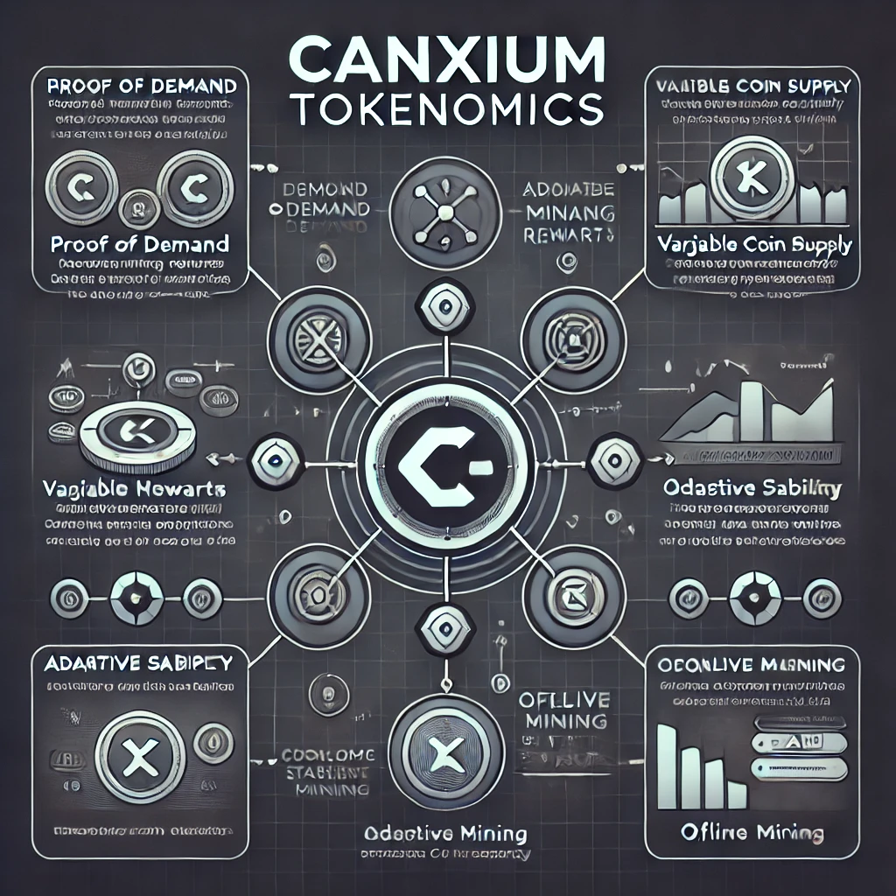
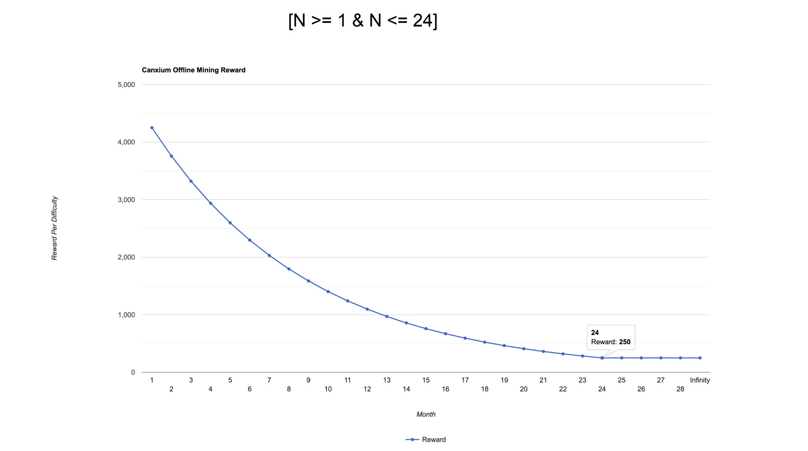

# Whitepaper {#whitepaper}

:::info You are reading the latest version of Canxium Whitepaper

- Updated on **Nov 6, 2024**.
- Version: v2.5
  :::
  
## Tokenomics


:::danger
Canxium is a Fair-launched project in April of 2023 with no pre-mine, zero pre-sales, and no coin pre-allocations; Canxium is 100% decentralized, open-source, community managed and developed by Canxium Labs.
:::

Canxium’s unique tokenomics form the bedrock of its ecosystem, driving the distribution, circulation, and utility of its native token, CAU. This section explores the key elements of Canxium’s tokenomics, providing a comprehensive overview of the principles governing the supply, utility, and role of CAU within the network.

Canxium operates with a dynamic, demand-driven token supply, and it does not have a fixed or maximum supply cap. Unlike traditional cryptocurrencies with predetermined supply limits, Canxium’s coin issuance is directly tied to market demand. This approach allows the network to adapt to fluctuating user activity, demand, and overall usage patterns, ensuring that the supply of CAU aligns with the needs of the ecosystem.

However, while the supply mechanism is unlimited in theory, mining new CAU coins is far from trivial. The process requires miners to reach a significant total mining difficulty—specifically 4 PH (Petahash)—before a new CAU can be created. This high threshold ensures that mining remains a challenging and energy-intensive process, making infinite supply mathematically impractical. As a result, while the system is designed to be scalable and adaptable, the creation of new coins is still bound by technical constraints and market realities.

This adaptive model ensures that Canxium can respond to changes in demand without the risks of hyperinflation or uncontrolled token issuance, striking a balance between growth, stability, and sustainability in the long term.

Before the **Hydro Fork** at block 4,354,526, the block reward 0.25 CAU distribution on the Canxium blockchain follows a clear structure:

- **75% to Miners**:  
  The majority of the block reward, 75%, is credited to the miners. This incentivizes miners for their contribution to securing the network and validating transactions. It ensures that the mining participants receive a significant portion of the reward for their computational work in the Proof of Work (PoW) system.

- **25% to Canxium Labs**:  
  The remaining 25% of the block reward is allocated to Canxium Labs. This portion is dedicated to supporting the development, marketing, and overall growth of Canxium during the early stages of its operation. This fund helps ensure the sustainability of the project by financing key activities such as research, marketing campaigns, community engagement, and infrastructure development.

This reward model helps Canxium balance between incentivizing miners and ensuring the long-term viability and expansion of the ecosystem through continued development efforts. With the **Hydro Fork**, these dynamics might change as Canxium transitions towards Proof of Stake (PoS) and updates the reward distribution mechanism to align with the evolving network model.

After the **Hydro Fork**, Canxium transitioned to **offline mining**, with the reward distribution for transaction mining adjusted as follows:

- **70% to 75% to Offline Miners**:  
  A significant portion of the transaction mining rewards, ranging from 70% to 75%, is allocated to offline miners. These miners are responsible for generating valid mining transactions and submitting them to the network. The reward is proportional to the difficulty level chosen by the miner, encouraging active participation while promoting energy-efficient mining practices.

- **15% to Canxium's Validators**:  
  Validators receive 15% of the transaction mining rewards. Their role involves verifying and finalizing the mined transactions, ensuring the integrity and security of the blockchain. Validators continue to play a crucial role in the Canxium ecosystem by validating the blocks and transactions generated by offline miners.

- **10% to 15% to Canxium Labs**:  
  The remaining 10% to 15% of the rewards are directed to Canxium Labs. This portion supports the development, marketing, and operational costs of Canxium, helping to fund ecosystem growth, research, community initiatives, and infrastructure improvements.

This reward distribution model, which focuses on rewarding both offline miners and validators while ensuring continued development through the fund, is designed to promote sustainability, decentralization, and growth for the Canxium blockchain after the fork.

The transaction mining reward will be determined by difficulty and will start at 4250 Wei per difficulty if the mining algorithm is Ethash.

Before the transition to PoS, offline mining will not be available on the mainnet, as we want miners to focus their resources on block mining to secure the PoW network. After the transition to PoS, offline mining will be the only way to generate more CAU.

The mining difficulty adjustment process will take place gradually over 24 months after the successful merge to PoS. It will begin with a mining reward of 4250 Wei per difficulty and will end at 250 Wei per difficulty.

```Reward (N) = 4250 * 0.8842 ^ (N-1)```


## Dual Token System


Canxium introduces a unique dual-token system designed to optimize the functionality, rewards, and user experience within its ecosystem. The two tokens, **$CAU** and **$OFF**, each serve distinct and critical roles that support both the network's operational structure and its long-term sustainability.

#### 1. **Native Utility Coin: $CAU**

The **$CAU** token is Canxium’s native cryptocurrency, serving as the primary utility coin within the Canxium blockchain ecosystem. It is used for a wide range of functions, including:

- **Transaction Fees**: $CAU is required to pay transaction fees on the network, enabling users to perform various operations such as transferring funds or interacting with smart contracts.
  
- **Validator Participation**: Validators need to stake **$CAU** to secure the network and participate in block creation and validation within the Proof of Stake (PoS) consensus mechanism.

- **Platform Benefits**: Holding $CAU offers users access to special privileges, discounts, or incentives on the platform as the ecosystem evolves.

As the backbone of Canxium's ecosystem, $CAU will drive the network's services and functions, ensuring a stable and functional economic model for users, validators, and other stakeholders.

#### 2. **Mining Token: $OFF**

Canxium is pioneering the combination of both **Proof of Work (PoW)** and **Proof of Stake (PoS)** consensus mechanisms, with PoW remaining at the core of its design. After transitioning to **offline mining**, Canxium will introduce **$OFF**, a secondary token specifically for mining activities. 

- **Mining Rewards**: Miners will use the $OFF token in conjunction with mining activities. They will need to burn **$OFF** tokens with each mining transaction to qualify for **$CAU** rewards. This burn mechanism ensures that the value of $OFF remains integral to the mining process and further supports Canxium's economic model by introducing scarcity and incentivizing participation.

- **Offline Mining**: With the offline mining mechanism in place, miners will be able to mine new CAU coins without needing a constant internet connection, but they will still need to use $OFF to enhance their mining rewards by 5%.

This token's introduction provides a clear distinction between **network utility and mining rewards**, while also offering miners a direct method to optimize their participation and rewards in the ecosystem.